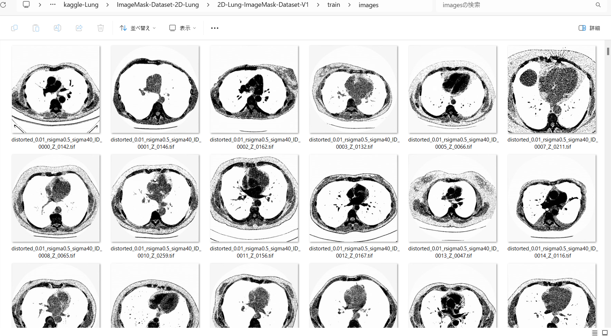
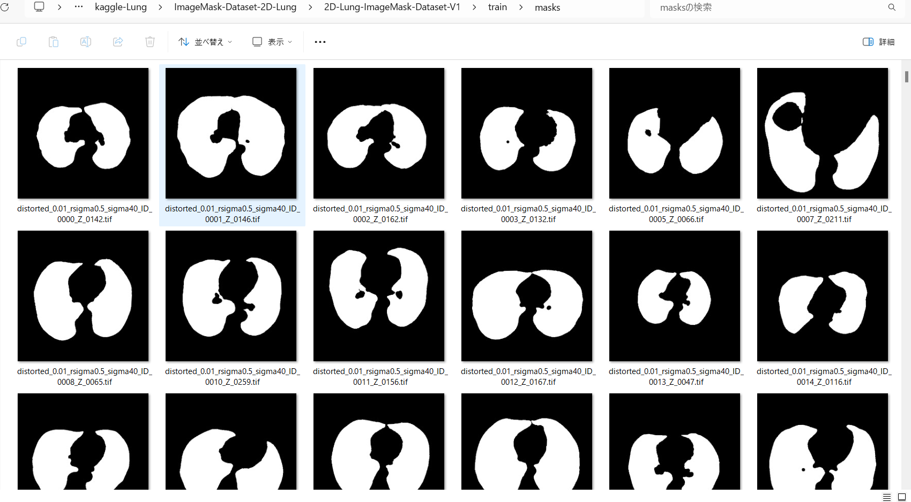
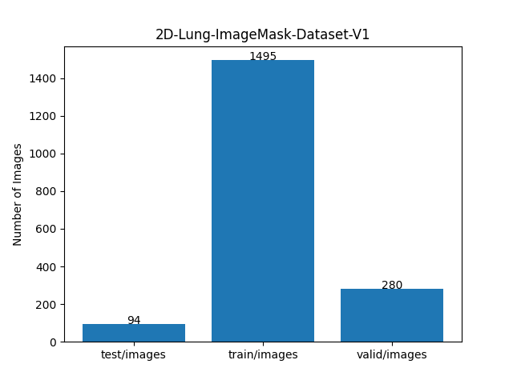

<h2> ImageMask-Dataset-2D-Lung (2024/05/01)</h2>

This is a simple ImageMask Dataset for 2D-Lung Image Segmentation. 
The dataset used here has been taken from the following kaggle web-site 
<b>Finding and Measuring Lungs in CT Data</b> 
A collection of CT images, manually segmented lungs and measurements in 2/3D
 

<pre>https://www.kaggle.com/datasets/kmader/finding-lungs-in-ct-data/data</pre> 
We have generated augmented test, train, and valid datasets of 512x512 pixel-size from the original 2d-images and 2d-masks datasets.
  
 
<table>
<tr>
<td>
<b>2D-Lung image sample </b> 

</td>
<td>
<b>2D-Lung mask sample </b> 

</td>
</tr>
</table>
 

You can download our augmented <b>2D-Lung-ImageMask-Dataset</b> from the google drive
<a href="https://drive.google.com/file/d/1tO8cWSlw7xN9O6O72xMZQD6eJ4OObjE2/view?usp=sharing">
2D-Lung-ImageMask-Dataset-V1.zip
</a>
 

<h3>1. Dataset Citation</h3>
<b>Abound Dataset</b> 
<b>Context</b> 
<pre>
Competitions like LUNA (http://luna16.grand-challenge.org) and the Kaggle Data Science Bowl 2017 
(https://www.kaggle.com/c/data-science-bowl-2017) involve processing and trying to find lesions 
in CT images of the lungs. In order to find disease in these images well, it is important to first find the lungs well. 
This dataset is a collection of 2D and 3D images with manually segmented lungs.
</pre>
<b>Challenge</b> 
<pre>
Come up with an algorithm for accurately segmenting lungs and measuring important clinical parameters 
(lung volume, PD, etc)
</pre>
<b>Percentile Density (PD)</b> 
<pre>
The PD is the density (in Hounsfield units) the given percentile of pixels fall below in the image. 
The table includes 5 and 95% for reference. For smokers this value is often high indicating the build 
up of other things in the lungs.
</pre>
 
<h3>2. ImageMask Dataset Generation</h3>

If you would like to generate your own ImageMask-Dataset, please download the two original master datataset of  
2d-images and 2d-masks from the kaggle-web site <a href="https://www.kaggle.com/datasets/kmader/finding-lungs-in-ct-data/data">Finding and Measuring Lungs in CT Data</a>. 

Please run the following command for Python script <a href="./ImageMaskDatasetGenerator.py">ImageMaskDatasetGenerator.py</a>.
 
<pre>
> python ImageMaskDatasetGenerator.py
</pre>
This script executes the following two processings.  

From dataset
<pre>
./2d_images
  ├─*.tif
  ├─*,tif
  └─...
</pre>

<pre>
./2d_masks
  ├─*.tif
  ├─*,tif
  └─...
</pre>

the script will generate two images and masks folders under <b>./Lung-master</b> as shown below.
 
<pre> 
./Lung-master
├─images
│  ├─*.tif
│  ├─*.tif
│  └─...
└─masks
    ├─*.tif
    ├─*,tif
    └─...
</pre>
Please note that in this step, the original images and masks are augmented by flipping, rotating, distorting, and shrinking
 image processings. 

 

Please run the following command for Python <a href="./split_master.py">split_master.py</a> 
 
<pre>
>python split_master.py
</pre>
, by which test, train and valid subdatasets will be created under <b>./2D-Lung-ImageMask-Dataset-V1</b>. 
<pre>
./2D-Lung-ImageMask-Dataset-V1
├─test
│  ├─images
│  └─masks
├─train
│  ├─images
│  └─masks
└─valid
    ├─images
    └─masks
</pre>

Train images sample 
  
Train mask sample 
  

Dataset Statictics  
 

